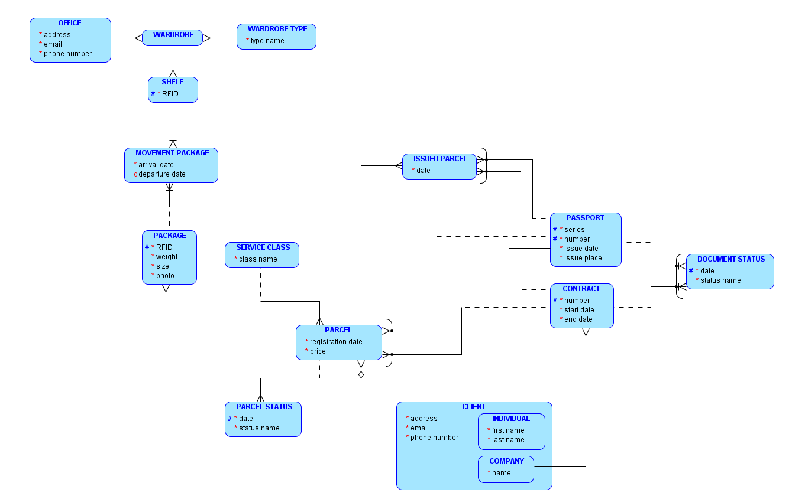

# Сервис доставки особо ценных отправлений

### Бизнес-правила

- Организация состоит из множества офисов. Деятельность организации заключается в передаче отправлений между клиентами организации.
- Взаимодействие с клиентом осуществляется во множестве офисов сервиса.
- Отправитель и получатель должны быть зарегистрированными клиентами сервиса.
- Отправить и получить отправление клиенты могут как в разных офисах, так и в одном офисе.
- Один и тот же клиент может быть одновременно отправителем и получателем в одном или разных офисах.
- Клиентом может быть физическое или юридическое лицо.
- У физлица документом является паспорт.
- С юрлицом заключается срочный договор.
- Необходимо предусмотреть возможность расширения видов документов.
- Возможно наличие более одного действующего документа у клиента, с любым из них можно отправить и получить отправление.
- При отправке отправитель указывает получателя, офис получения, не указывается планируемая дата получения.
- Сервис хранит отправление до востребования, получателя информируют об ожидающих отправлениях.
- Организация предлагает три класса обслуживания отправлений, при отправке клиент выбирает класс обслуживания. Класс обслуживания присваивается каждому отправлению.
- После отправления можно изменить офис доставки, но не получателя.
- Получатель может предъявить любой из зарегистрированных действующих документов.
- Информация о клиентах и их документах никогда не удаляются.
- Одному из действующих документов клиента всегда устанавливается статус основного.
- При отправке и получении отправлений в базу данных вносится информация о документе на основании которого отправитель отправил, и получатель получил посылку.
- В базе данных хранится история отправлений связанная с клиентом, получателем, документом по которому создано отправление и документ с которым получено отправление.
- В одном отправлении может быть один и более пакетов (в штуках).
- Одно отправление может быть только одному получателю, не допускается в одном отправлении указывать получателей каждого пакета.
- В базе данных хранится история перемещения каждого пакета отправлений.
- На пакеты наносятся радиометки RFID для быстрого поиска.
- Каждый пакет фотографируется и взвешивается в офисе при отправке.
- Для получения отправления клиент предъявляют документ, сотрудник офиса валидирует получателя, сверяет информацию о предоставленном документе с имеющимся в базе данных, по RFID меткам находит пакеты отправления.
- В офисе пакеты хранятся на полках шкафов. Есть три типа шкафов.
- На полки также нанесены радиометки RFID для быстрого поиска.
- Отправление может быть в офисе на полке шкафа, или у экспедитора, который перевозит отправления между офисами.
- Каждое перемещение отправления фискируется записью в базе данных.
- Сервис должен максимально подробно хранить исторические данные.
- Работники сервиса обязаны максимально подробно писать комментарии в процессе работы с отправлениями

### Логическая модель

