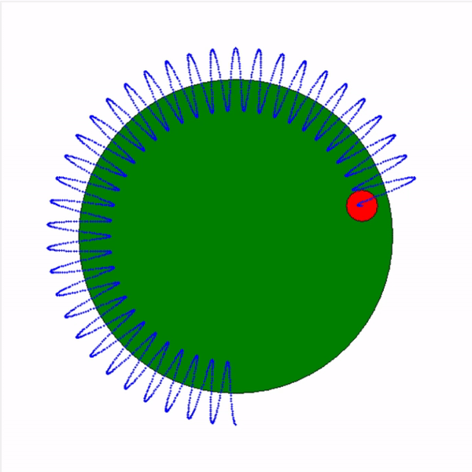
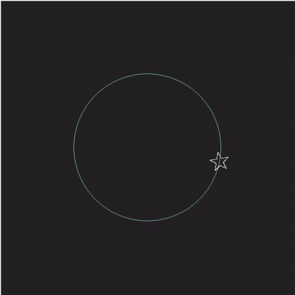

# Практическая работа 1

## Lemniscate_Bernoulli.py
Неравномерное движение точки по траектории "знак бесконечности"  

## sin_ball.py
Колебание точки на окружности  

## Solar_System.py
Движение точки по окружности (Например, Солнечная система)  

## star.py
Движение и поворот звезды  

