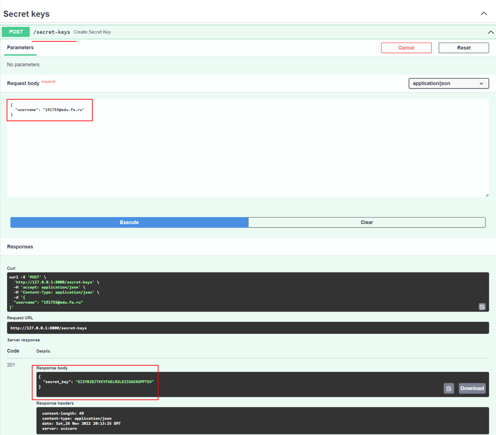
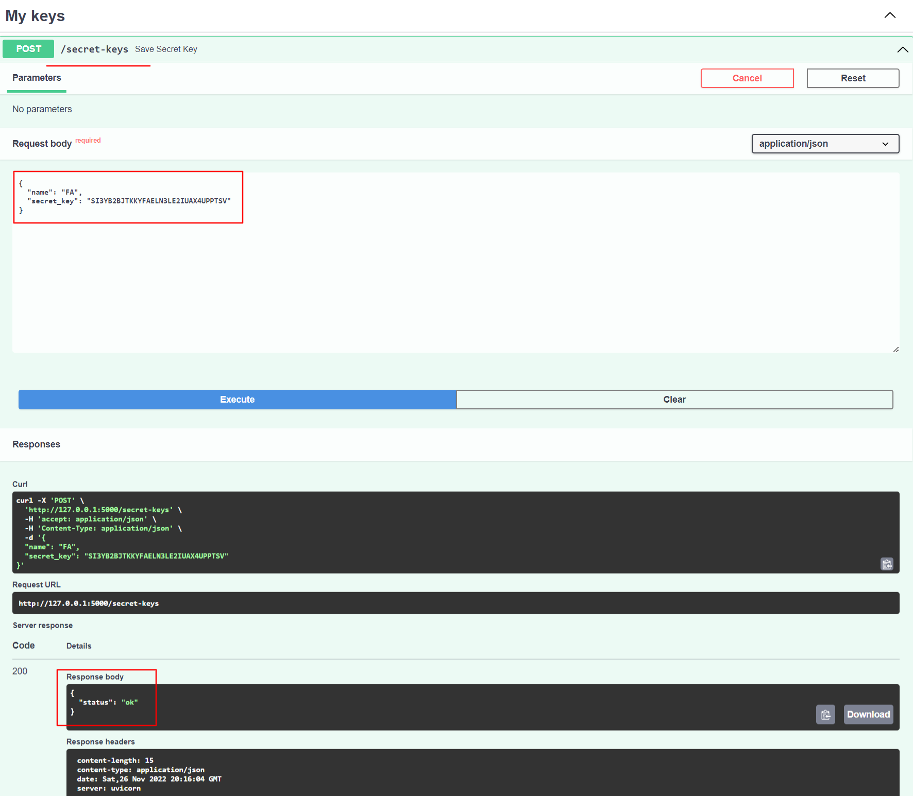
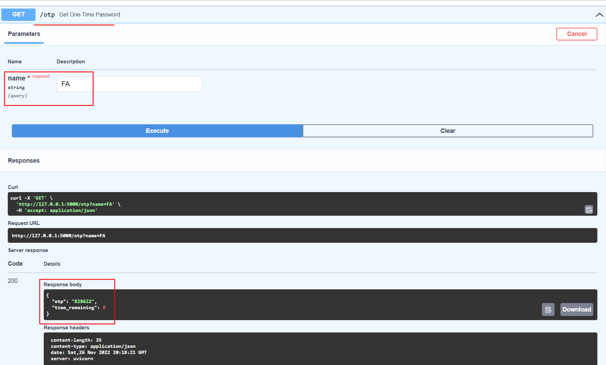
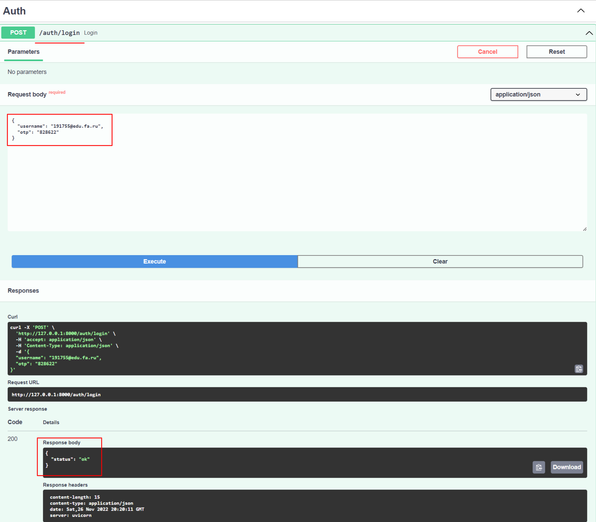

# Генератор одноразовых паролей с использованием HMAC


__GIF долго грузится, подождите...__

## Как использовать

Сгенерировать `secret_key` на сервере:



```
POST /secret-key -d '{"username": "191755@edu.fa.ru"}'

>>> {"secret_key": "CMA2CFRTH5A6SMRGSHKJINXG3525MMVZ"}
```

Сохранить `secret_key` для генерации OTP:



```
POST /secret-key -d '{"name": "FA", "secret_key": "CMA2CFRTH5A6SMRGSHKJINXG3525MMVZ"}'

>>> {"status": "ok"}
```

Сгенерировать One-Time Password:



```
GET /otp?name=FA

>>> {"otp": "119174", "time_remaining": 29}
```

Авторизоваться, используя OTP:



```
POST /auth/login -d '{"username": "191755@edu.fa.ru", "otp": "119174"}'

>>> {"status": "ok"}
```
