# Проект. Проектирование базы данных

## 1. Тема

## 2. Выявление и определение сущностей.

## 3. Определение атрибутов сущностей и их типов.

<details>
<summary> <b>ACHIEVEMENT</b> </summary>
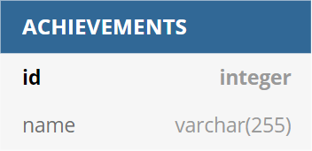

   ```dbml
Table ACHIEVEMENTS {
    id integer [pk, increment]
    name varchar(255) [not null]
}
   ```
</details>

<details>
<summary> <b>ARTICLE COMMENT</b> </summary>
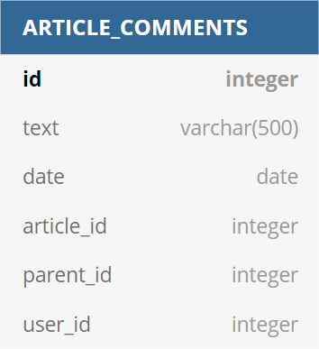

   ```dbml
Table ARTICLE_COMMENTS {
    id integer [pk, increment]
    text varchar(500) [not null]
    date date [not null]
    article_id integer [not null]
    parent_id integer [null]
    user_id integer [not null]
}
   ```
</details>

<details>
<summary> <b>ARTICLE</b> </summary>
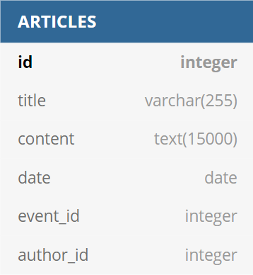

   ```dbml
Table ARTICLES {
    id integer [pk, increment]
    title varchar(255) [not null]
    content text(15000) [not null]
    date date [not null]
     event_id integer [null]
    author_id integer [not null]
}
   ```
</details>

<details>
<summary> <b>EVENT</b> </summary>
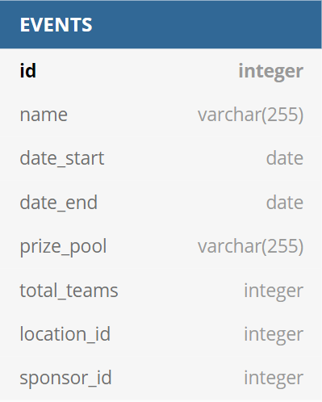

   ```dbml
Table EVENTS {
    id integer [pk, increment]
    name varchar(255) [not null]
    date_start date [not null]
    date_end date [not null]
    prize_pool varchar(255) [not null]
    total_teams integer [not null]
    location_id integer [not null]
    sponsor_id integer [not null]
}
   ```

</details>

<details>
<summary> <b>LOCATION</b> </summary>
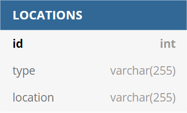

   ```dbml
Table LOCATIONS {
    id int [pk, increment]
    type varchar(255) [not null]
    location varchar(255) [not null]
}
   ```
</details>

<details>
<summary> <b>MAP</b> </summary>
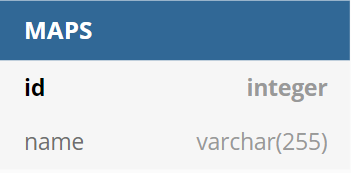

   ```dbml
Table MAPS {
    id integer [pk, increment]
    name varchar(255) [unique, not null]
}
   ```
</details>

<details>
<summary> <b>MATCH COMMENT</b> </summary>
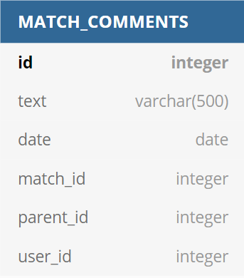

   ```dbml
Table MATCH_COMMENTS {
    id integer [pk, increment]
    text varchar(500) [not null]
    date date [not null]
    match_id integer [not null]
    parent_id integer [null]
    user_id integer [not null]
}
   ```
</details>

<details>
<summary> <b>MATCH TYPE</b> </summary>
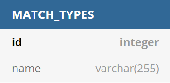

   ```dbml
Table MATCH_TYPES {
    id integer [pk, increment]
    name varchar(255) [unique, not null]
}
   ```
</details>

<details>
<summary> <b>MATCH</b> </summary>
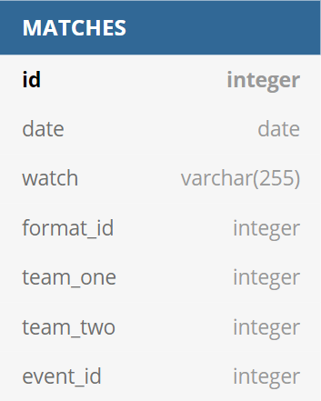

   ```dbml
Table MATCHES {
    id integer [pk, increment]
    date date [not null]
    watch varchar(255) [null]
    format_id integer [not null]
    team_one integer [null]
    team_two integer [null]
    event_id integer [not null]
}
   ```
</details>

<details>
<summary> <b>PLAYER</b> </summary>
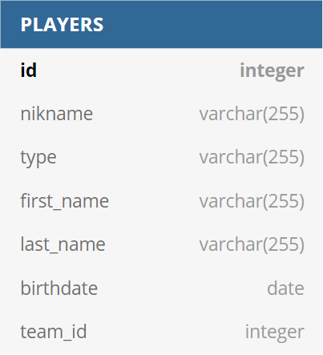

   ```dbml
Table PLAYERS {
    id integer [pk, increment]
    nikname varchar(255) [not null]
    type varchar(255) [not null]
    first_name varchar(255) [null]
    last_name varchar(255) [null]
    birthdate date [null]
     team_id integer [null]
}
   ```
</details>

<details>
<summary> <b>ROLE</b> </summary>
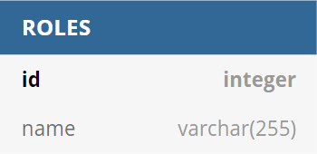

   ```dbml
Table ROLES {
    id integer [pk, increment]
    name varchar(255) [unique, not null]
}
   ```
</details>

<details>
<summary> <b>SPONSORS</b> </summary>
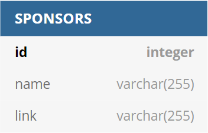

   ```dbml
Table SPONSORS {
    id integer [pk, increment]
    name varchar(255) [not null]
    link varchar(255) [null]
}
   ```
</details>

<details>
<summary> <b>TEAMS</b> </summary>
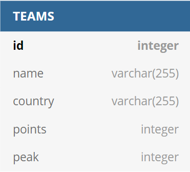

   ```dbml
Table TEAMS {
    id integer [pk, increment]
    name varchar(255) [not null]
    country varchar(255) [not null]
    points integer [not null]
    peak integer [not null]
}
   ```
</details>

<details>
<summary> <b>USER</b> </summary>


   ```dbml
Table USERS {
    id integer [pk, increment]
    username varchar(255) [unique, not null]
    password varchar(255) [not null]
    email varchar(255) [not null]
    country varchar(255) [null]
    role_id integer [not null]
    fav_player_id integer [null]
    fav_team_id integer [null]
}
   ```
</details>

## 4. Матрица связей

|       | Achievement | Article comment | Article | Event | Location | Map | Match comment | Match type | Match | Player | Role | Sponsor | Team | User |
| ---: | :---: | :---: | :---: | :---: | :---: | :---: | :---: | :---: | :---: | :---: | :---: | :---: | :---: | :---: |
| **Achievement** |     |     |
| **Article comment** |     |     |
| **Article** |     |     |
| **Event** |     |     |
| **Location** |     |     |
| **Map** |     |     |
| **Match comment** |     |     |
| **Match type** |     |     |
| **Match** |     |     |
| **Player** |     |     |
| **Role** |     |     |
| **Sponsor** |     |     |
| **Team** |     |     |
| **User** |     |     |

## 5. Логическая модель

## 6. Реляционная модель

TODO
