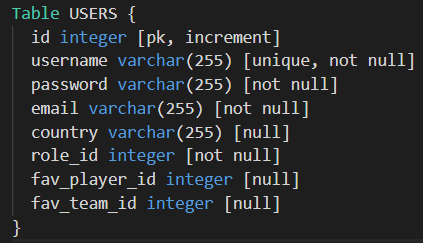
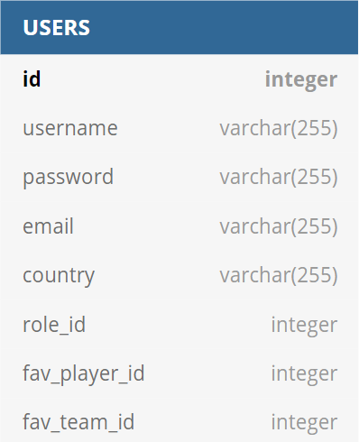

# Проект. Проектирование базы данных

## 1. Тема

## 2. Выявление и определение сущностей.

## 3. Определение атрибутов сущностей и их типов.

| dbml | Сущность | Комментарий |
| ---- | :------- | :---------- |
| [users.dbml](dbml/users.dbml) |    ||

## 4. Матрица связей

## 5. Логическая модель

## 6. Реляционная модель

TODO
