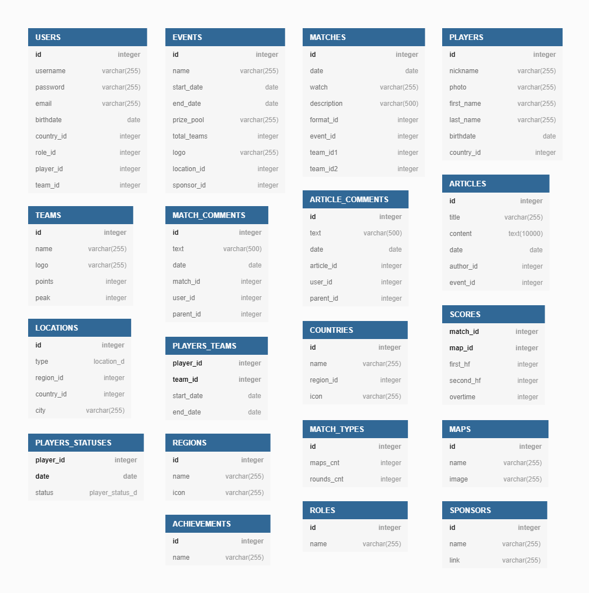
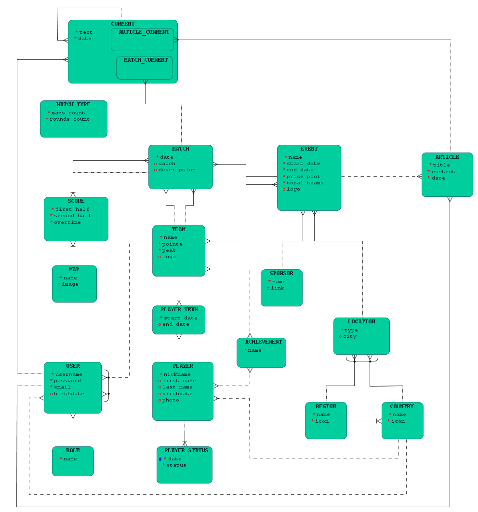

# Проект. Проектирование базы данных

## Оглавление

   * [Выбор темы. Постановка задачи](#выбор-темы-постановка-задачи)
   * [Выявление и определение сущностей](#выявление-и-определение-сущностей)
   * [Определение атрибутов сущностей и их типов](#определение-атрибутов-сущностей-и-их-типов)
   * [Матрица связей](#матрица-связей)
   * [Логическая модель](#логическая-модель)
   * [Реляционная модель](#реляционная-модель)

## Выбор темы. Постановка задачи

Разработка модели данных для системы управления базы данных новостного сайта и форума [**hltv.org**](https://www.hltv.org/).

База данных должна способствовать реализации следующего функционала:

- Пользователи с особым **статусом** могут создавать **статьи** и публиковать **новости**. Другой статус разрешает пользователям публиковать короткие highlight-ролики. Также есть администраторы и модераторы форума, которые могут редактировать контент, удалять его или скрывать, блокировать пользователей и удалять комментарии.
- Каждый **авторизованный пользователь** имеет **уникальный nickname**; в настройках профиля может указать **страну**, выбрать **любимого игрока** **или** (но не одновременно) **любимую команду**, которые будут отображаться рядом с его nickname'ом.
- Любые авторизованные пользователи могут **комментировать** **новости**, **статьи** и **предстоящие матчи**, а также **отвечать** на комментарии других пользователей.
- На сайте представлена информация о грядущих **турнирах**, а именно: **название** турнира; **даты** начала и конца проведения турнира; **организатор** турнира, **призовой фонд** (может выражаться как в денежном эквиваленте так и приглашением на следующую стадию турнира); **место проведения** - в зависимости от **формата** турнира (offline или online) местом может быть либо **страна и город**, либо просто название **региона**; **количество команд**-участников, при этом некоторые команды могут быть не определены.
- На сайте представлена информация о предстоящих матчах, а именно: **дата и время начала** встречи; **две команды**, при этом они могут быть ещё не определены; **формат** матча (bo1, bo2, ...); ближе к началу матча становятся известны названия **карт**, на которых пройдет встреча; ссылка на доступную **трансляцию**. Каждый **матч проходит в рамках** какого-либо **турнира**.
- На сайте представлена информация о **командах** и **игроках**.
- В команде может числиться **любое количество игроков**, но участвовать в матче могут только пятеро. Игроки могут иметь разные **статусы**, такие как игрок-замена, неактивный игрок, иногда в матчах игрока может заменить тренер команды.
- За победы на турнирах и другие заслуги команды и игроки могут получать **достижения** (команды также получают очки). При этом достижение полученное командой, закрепляется и за командой, и за игроком.
- `TODO: функционал будет расширяться`

## Выявление и определение сущностей

Исходя из условия задачи я выделил следующие сущности:

- **user** - зарегистрированный/авторизованный пользователь сайта.
- **role** - статус пользователя, определяющий его возможности.
- **article** - опубликованная статья или новость.
- **article comment** - комментарий оставленный к статье или ответ на этот комментарий.
- **event** - информация о предстоящем турнире.
- **sponsor** - информация об организаторе турнира.
- **location** - место проведения турнира в зависимости от его типа.
- **match** - информация о предстоящем матче.
- **match type** - информация о формате проведения турнира, кол-ве карт и раундов.
- **map** - информация о карте на которой будет проходить игра.
- **match comment** - комментарий оставленный к матчу или ответ на этот комментарий.
- **team** - информация о киберспортивной комманде.
- **player** - информация об игроке, его игровой статус.
- **achievement** - достижение, которое может получить комманды или игрок.
- **country** - вспомогательная таблица с названиями стран и иконками их флагов.
- **region** - вспомогательная таблица с названиями регионов.
- `TODO: сущности будут добавляться`

## Определение атрибутов сущностей и их типов



<details>
<summary> domains </summary>

   ```dbml
enum location_domain {
    offline
    online
}

enum player_domain {
    active
    inactive
    standin
    coach
}
   ```
</details>

<details>
<summary> dbml </summary>

   ```dbml
Table USERS {
    id integer [pk, increment]
    username varchar(255) [unique, not null]
    password varchar(255) [not null]
    email varchar(255) [not null]
    birthdate date [null]
    country_id integer [null]
    role_id integer [not null]
    player_id integer [null, note: 'favorite player']
    team_id integer [null, note: 'or favorite team']
}

Table ROLES {
    id integer [pk, increment]
    name varchar(255) [unique, not null]
}

Table ARTICLES {
    id integer [pk, increment]
    title varchar(255) [not null]
    content text(10000) [not null]
    date date [not null]
    author_id integer [not null]
    event_id integer [null]
}

Table ARTICLE_COMMENTS {
    id integer [pk, increment]
    text varchar(500) [not null]
    date date [not null]
    article_id integer [not null]
    user_id integer [not null]
    parent_id integer [null]
}

Table MATCH_COMMENTS {
    id integer [pk, increment]
    text varchar(500) [not null]
    date date [not null]
    match_id integer [not null]
    user_id integer [not null]
    parent_id integer [null]
}

Table EVENTS {
    id integer [pk, increment]
    name varchar(255) [not null]
    date_start date [not null]
    date_end date [not null]
    prize_pool varchar(255) [not null]
    total_teams integer [not null]
    logo varchar(255) [null]
    location_id integer [not null]
    sponsor_id integer [not null]
}

Table SPONSORS {
    id integer [pk, increment]
    name varchar(255) [not null]
    link varchar(255) [null]
}

Table LOCATIONS {
    id int [pk, increment]
    type location_domain [not null]
    region_id int [null]
    country_id int [null]
    city int [null]
}

Table MATCHES {
    id integer [pk, increment]
    date date [not null]
    watch varchar(255) [null]
    description varchar(500) [null]
    format_id integer [not null]
    event_id integer [not null]
    team_id1 integer [null]
    team_id2 integer [null]
}

Table MATCH_TYPES {
    id integer [pk, increment]
    maps_count integer [not null]
    rounds_count integer [not null]
}

Table MAPS {
    id integer [pk, increment]
    name varchar(255) [unique, not null]
    image varchar(255) [not null]
}

Table TEAMS {
    id integer [pk, increment]
    name varchar(255) [not null]
    logo varchar(255) [null]
    points integer [not null]
    peak integer [not null]
    region_id integer [null]
    country_id integer [null]
}

Table PLAYERS {
    id integer [pk, increment]
    nickname varchar(255) [not null]
    type player_domain [not null]
    first_name varchar(255) [null]
    last_name varchar(255) [null]
    birthdate date [null]
    country_id integer [null]
    team_id integer [null]
}

Table ACHIEVEMENTS {
    id integer [pk, increment]
    name varchar(255) [not null]
}

Table COUNTRIES {
    id integer [pk, increment]
    name varchar(255) [not null]
    region_id integer [null]
}

Table REGIONS {
    id integer [pk, increment]
    name varchar(255) [unique, not null]
}

enum location_domain {
    offline
    online
}

enum player_domain {
    active
    inactive
    standin
    coach
}
   ```
</details>

## Матрица связей

|   | Achievement | Article comment | Article | Country | Event | Location | Map | Match comment | Match type | Match | Player | Region | Role | Sponsor | Team | User |
| ---: | :---: | :---: | :---: | :---: | :---: | :---: | :---: | :---: | :---: | :---: | :---: | :---: | :---: | :---: | :---: | :---: |
| **Achievement** |  |  |  |  |  |  |  |  |  |  | принадлежит |  |  |  | принадлежит |  |
| **Article comment** |  | ответ на | относится к |  |  |  |  |  |  |  |  |  |  |  |  | написан |
| **Article** |  | содержит |  |  | относится к |  |  |  |  |  |  |  |  |  |  | написана |
| **Country** |  |  |  |  |  |  |  |  |  |  |  |  |  |  |
| **Event** |  |  | упоминается в |  |  | проводится в |  |  |  | включает в себя |  |  |  | проводится | проводится для |  |
| **Location** |  |  |  |  | место проведения для |  |  |  |  |  |  |  |  |  |  |  |
| **Map** |  |  |  |  |  |  |  |  |  | играется в |  |  |  |  |  |  |
| **Match comment** |  |  |  |  |  |  |  | ответ на |  | относится к |  |  |  |  |  | написан |
| **Match type** |  |  |  |  |  |  |  |  |  | описывает |  |  |  |  |  |  |
| **Match** |  |  |  |  | принадлежит |  | играется на | содержит | проводится в формате |  |  |  |  |  | участвует |  |
| **Player** | имеет |  |  |  |  |  |  |  |  |  |  |  |  |  | состоит в | фаворит для |
| **Region** |  |  |  |  |  |  |  |  |  |  |  |  |  |  |  |  |
| **Role** |  |  |  |  |  |  |  |  |  |  |  |  |  |  |  | описывает |
| **Sponsor** |  |  |  |  | проводит |  |  |  |  |  |  |  |  |  |  |  |
| **Team** | имеет |  |  |  | приглашена на |  |  |  |  | участвует в | содержит |  |  |  |  | фаворит для |
| **User** |  | написал | написал |  |  |  |  | написал |  |  | выбрал |  | имеет |  | выбрал |  |

## Логическая модель



## Реляционная модель

TODO
