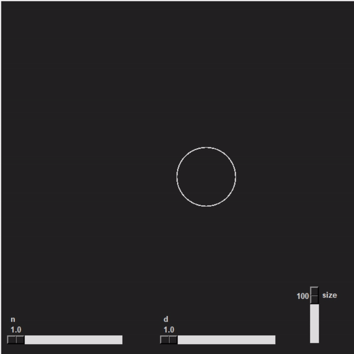
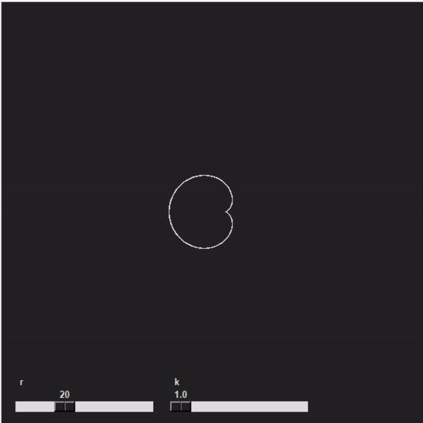
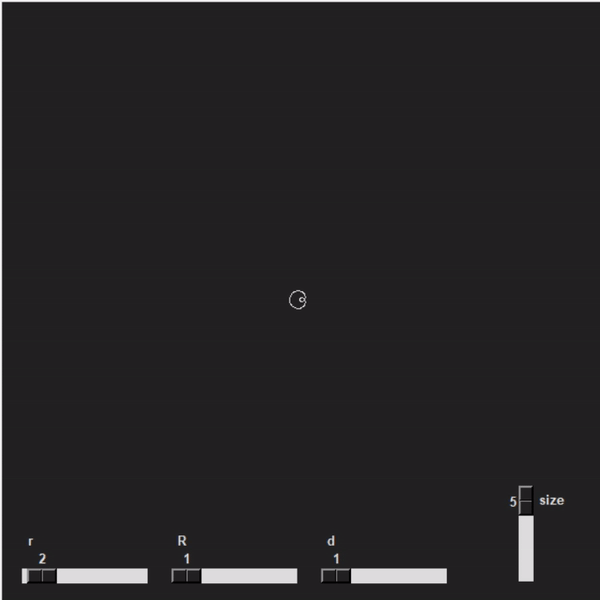
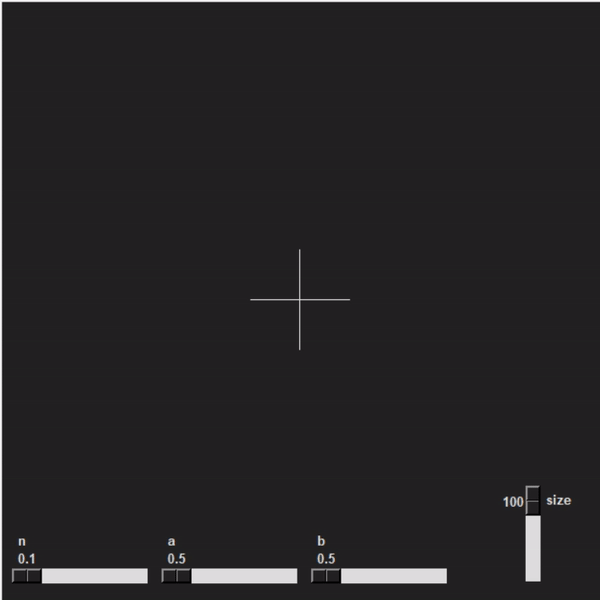
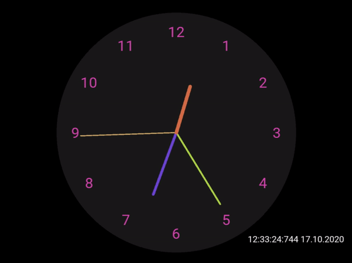

# Практическая работа 2

## polar_rose.py
Полярная Роза (параметрическая кривая)

## epicycloid.py
Эпициклоида (параметрическая кривая)

## hypotrochoid.py
Гипотрохоида (параметрическая кривая)

## superellipse.py
Суперэллипс (параметрическая кривая

## heart.py
Закрашивание сердца

## lorenz_system.py
Аттрактор Лоренца

## clock.py
Часы с плавным ходом стрелок

